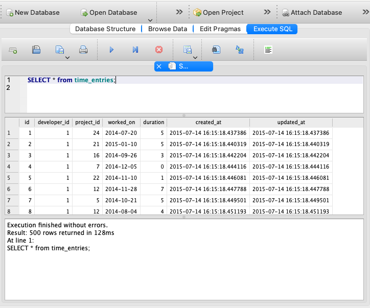

# SQL Practice: Time Entry Queries

In this repo you'll find a SQLite database that includes data for tracking time entries. This assignment asks you to create a set of SQL queries to extract information in order to answer questions about the data.

You will need to write SQL queries with:

- SELECT
- FROM
- WHERE
- GROUP
- HAVING
- INNER JOIN
- LEFT JOIN

## Where do I write these queries?

If you are using DB Browser for SQLite, you can use the Execute SQL tab at the top of the window to open up an interface where you can write SQL and run it. After typing it out, you run it by clicking the ▶️ icon or using `⌘R`. Don't forget to end the line with a semicolon.

_DB Browser for SQLite_

You can also write queries using the SQLite CLI. That's a command line interface to write SQL for a SQLite database. [Consult the documentation for how to do that](https://www.sqlite.org/cli.html).

## Normal Mode

- Find all time entries.
- Find the developer who joined most recently.
- Find the number of projects for each client.
- Find all time entries, and show each one's client name next to it.
- Find all developers in the "Ohio sheep" group.
- Find the total number of hours worked for each client.
- Find the client for whom Mrs. Lupe Schowalter (the developer) has worked the greatest number of hours.
- List all client names with their project names (multiple rows for one client is fine).  Make sure that clients still show up even if they have no projects.
- Find all developers who have written no comments.

Unless otherwise specified, return all columns in the requested table (e.g. developers).

## Hard Mode

All of the above, plus these queries:

- Find all developers with at least five comments.
- Find the developer who worked the fewest hours in January of 2015.
- Find all time entries which were created by developers who were not assigned to that time entry's project.
- Find all developers with no time put towards at least one of their assigned projects.
- Find all pairs of developers who are in two or more different groups together.

## Nightmare Mode

All of the above, plus these queries:

- For all clients, find the duration of the time entry which was entered most recently for that particular client.
- Find a list of the missing developer ids. This is tough to grok. In the real world, the list of ids in a data table can become sparse over time. We may have created developers 1 through 10, and then deleted 4, 5, 6, and 9. This means that the list of ids present in the developers table will be 1, 2, 3, 7, 8, 10. In this scenario, your query should find the gaps and return 4, 5, 6, and 9.

## 🔖 Resources

- [SQLite Docs](https://www.sqlite.org/index.html)
- [SQLite CLI](https://www.sqlite.org/cli.html)
- [DB Browser for SQLite Docs](https://github.com/sqlitebrowser/sqlitebrowser/wiki)
